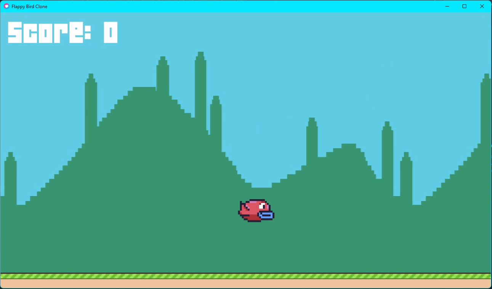

# Flappy Bird Clone
 This is a simple Flappy Bird Clone created in Lua!

 

 ## Setup and Installation

 REQUIRED:
 - Love2D

 Recommended IDEs:
 - Atom
 - Visual Studio Code

 For easy setup, please follow the instructions in this video:

 
